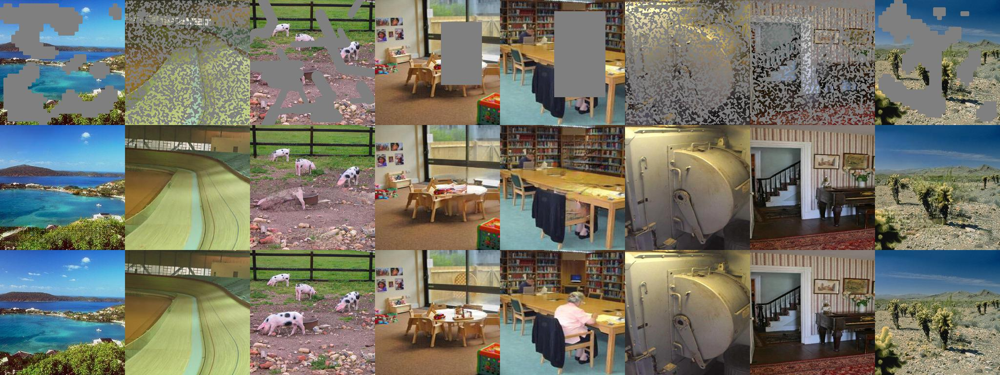
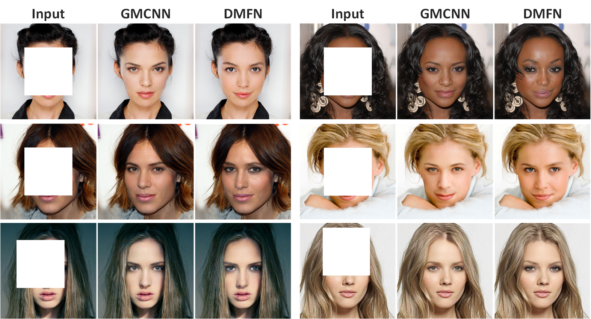

# Image Fine-grained Inpainting

## :sparkles: News
- Nov 11, 2021. **Upload the training code.**

- Nov 10, 2020. **Upload the test code. (Celeba-HQ)**

- Oct 4, 2020. **Update the main manuscript and the corresponding supplementary material.**

[[arXiv]](https://arxiv.org/abs/2002.02609)
[[Supplementary material]](https://drive.google.com/file/d/133l9inmBxAoJWKgyzLsLaOCSg-Dp9bk8/view?usp=sharing)

[[AIM 2020 Challenge on Image Extreme Inpainting]](https://arxiv.org/abs/2010.01110)

## Testing

## Training

## Example Results
### ADE20K Extreme Inpainting (AIM 2020)


### FFHQ results


### CelebA-HQ results



## Citation

If you find DMFN useful in your research, please consider citing:

```

@article{Hui-DMFN-2020,
  title={Image Fine-grained Inpainting},
  author={Hui, Zheng and Li, Jie and Wang, Xiumei and Gao, Xinbo},
  journal={arXiv:2002.02609},
  year={2020}
}

@InProceedings{ntavelis2020aim_inpainting,
author = {Evangelos Ntavelis and Andrés Romero and Bigdeli, Siavash and Radu Timofte and others},
title = {{AIM 2020} Challenge on Image Extreme Inpainting},
booktitle = {European Conference on Computer Vision Workshops},
year = {2020},
}
```
